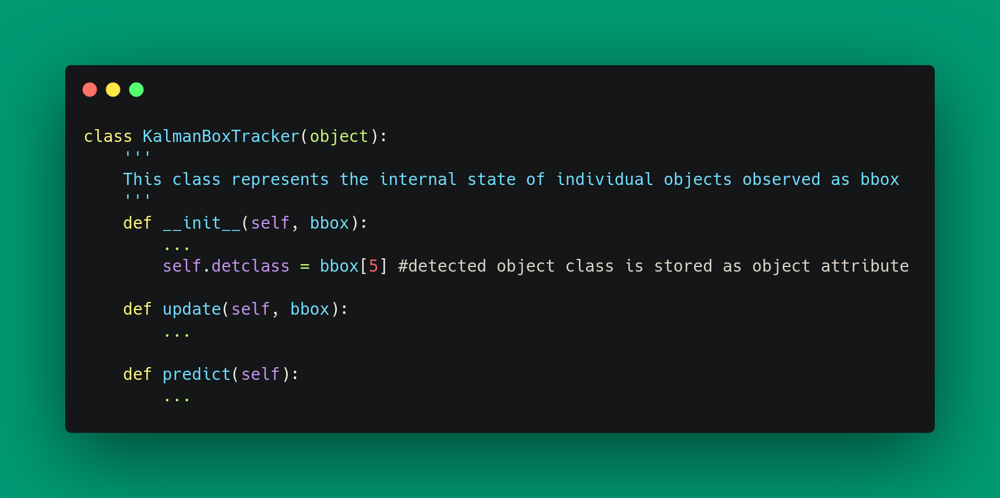

# ℂ𝕝𝕒𝕤𝕤𝕪𝕊𝕆ℝ𝕋

ClassySORT is a simple real-time multi-object tracker (MOT) that works for any kind of object class (not just people).

by Jason Sohn 


## Introduction

ClassySORT is designed to be a simple MOT for use on your own projects. And bcause the YOLO detector is pretrained on COCO, ClassySORT can detect and track 80 different kinds of common objects 'out of the box'. No supercomputer needed.

Modifying it is exactly the same process as training YOLO with your own dataset. [How do I do that?](https://github.com/ultralytics/yolov5/wiki/Train-Custom-Data)

**ClassySORT implements** 
+ [ultralytics/YOLOv5](https://github.com/ultralytics/yolov5/wiki) with no modifications
+ [abewley/SORT](https://github.com/abewley/sort) with minor modifications 

If you only need to track people, or have the resources to train a model from scratch with your own dataset, see 'More Complex MOTs' section below.

## Using ClassySORT

### Install Requirements
Python 3.8 or later with all requirements.txt. To install run:

```bash
pip install -r requirements.txt
```

### Run Tracking

To run the tracker on your own video, run:

```bash
python classy_track.py --source /path/to/video.mp4 --view-img --save-txt --save-img
```

To get a summary of arguments run:

```bash
python classy_track.py -h
```

The text results are saved to `/inference/output/` from the array above in a non-MOT compliant format. That location in the script is also a good point to plug your own programs into.

The saved text file contains the following information:

```bash
[frame_index, x_left_top, y_left_top, x_right_bottom, y_right_bottom, object_category, u_dot, v_dot, s_dot, object_id]
```

where

u_dot: time derivative of x_center in pixels
v_dot: time derivative of y_center in pixels
s_dot: time derivative of scale (area of bbox) in pixels

## Implementation Details

### Modifications to SORT

#### 1. Class-aware Tracking

The original implementation of SORT threw away YOLO's object class information (0: person, 1: bike, etc.).
I wanted to keep that information, so I added a `detclass` attribute to `KalmanBoxTracker` object in `sort.py`:



#### 2. Kalman Filter parameters

I found that for my own dataset in which bounding boxes change size fairly quickly, the default Q value (process covariance) was too low. I recommend you try experimenting with them.


## More Complex MOTs
If you only need to track people, or have the resources to train a model from scratch with your own dataset, then I recommend [bostom/Yolov5_DeepSort_PyTorch](https://github.com/mikel-brostrom/Yolov5_DeepSort_Pytorch).
DeepSORT adds a separately trained neural network on top of SORT, which increases accuracy for human detections but slightly decreases performance.
It also means that using your custom dataset involves training both YOLO and DeepSORT's 'deep association metric'

For a 'bag of tricks' optimized version of YOLOv5 + DeepSORT, see [GeekAlexis/FastMOT](https://github.com/GeekAlexis/FastMOT)

## License

ClassySORT is released under the GPL License to promote the open use of the tracker and future improvements.

## Visual Identity
ClassySORT theme color: 019973
